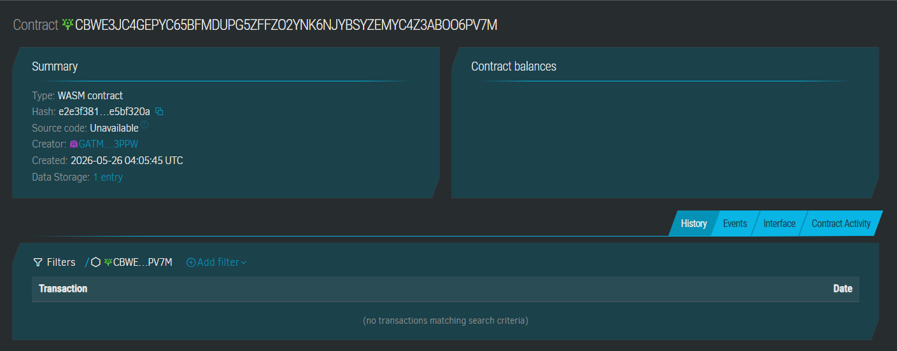

# TraScho — Transparent Scholarship Disbursement

> Instant, automated, tamper-proof scholarship allowances for Filipino university students — powered by Stellar and Soroban.
## Demo Screenshot


---

## Problem

In public universities in Quezon City, scholarship students from low-income families struggle with **delayed allowance releases** because school admins manually verify grades and attendance. This causes missed meals, unpaid transport fares, and dropouts due to financial strain — despite the students having already earned their aid.

## Solution

TraScho stores each student's eligibility data (grade + attendance) on a **Soroban smart contract**. The moment an admin pushes verified academic records, an eligible student can trigger an **automatic, atomic USDC transfer** directly to their Stellar wallet — no paperwork, no queues, no middlemen. Every disbursement is recorded immutably on-chain as a permanent audit trail.

---

## Timeline

| Phase | Duration | Milestone |
|-------|----------|-----------|
| Contract dev | Day 1–2 | `lib.rs` + `test.rs` passing |
| Frontend scaffold | Day 2–3 | Student dashboard + Admin panel |
| Testnet deploy | Day 3 | Live contract on Stellar Testnet |
| Demo integration | Day 4 | Full end-to-end flow demo-able |

---

## Stellar Features Used

| Feature | Usage |
|---------|-------|
| **USDC / Custom Token transfers** | Atomic disbursement from contract pool to student wallet |
| **Soroban smart contracts** | Eligibility logic, state storage, audit trail |
| **Trustlines** | Students accept the scholarship token before registration |
| **Stellar Testnet** | Development and demo environment |

---

## Vision & Purpose

Thousands of state scholarship recipients in the Philippines (CHED, DOST, TUPAD) wait weeks for manually-processed allowances. TraScho replaces this with a self-executing contract: once an authorized registrar pushes verified academic data, the money moves instantly. The immutable on-chain record also eliminates "ghost scholar" fraud — every peso is traceable.

Long-term: integrate with DepEd / CHED grade APIs to make eligibility updates fully automated.

---

## Prerequisites

- **Rust** `>= 1.74` with `wasm32-unknown-unknown` target  
  ```bash
  rustup target add wasm32-unknown-unknown
  ```
- **Stellar CLI** `>= 21.0.0`  
  ```bash
  cargo install --locked stellar-cli
  ```
- **Soroban SDK** `21.0.0` (managed via `Cargo.toml`)

---

## Build

```bash
# Compile the Wasm binary optimized for deployment
stellar contract build
```

Output: `target/wasm32-unknown-unknown/release/trascho.wasm`

---

## Test

```bash
cargo test
```

All 5 tests should pass:
- `test_happy_path_disburse_allowance`
- `test_edge_case_low_grade_rejected`
- `test_state_verification_after_disburse`
- `test_double_claim_rejected`
- `test_unregistered_student_cannot_claim`

---

## Deploy to Testnet

```bash
# 1. Generate or fund a testnet identity
stellar keys generate admin --network testnet
stellar keys fund admin --network testnet

# 2. Deploy the contract
stellar contract deploy \
  --wasm target/wasm32-unknown-unknown/release/trascho.wasm \
  --source admin \
  --network testnet

# Returns: CONTRACT_ID (save this)

# 3. Initialize (replace placeholders)
stellar contract invoke \
  --id <CONTRACT_ID> \
  --source admin \
  --network testnet \
  -- initialize \
  --admin <ADMIN_ADDRESS> \
  --token <USDC_TOKEN_ADDRESS>
```

---

## Sample CLI Invocations

### Register a student
```bash
stellar contract invoke \
  --id <CONTRACT_ID> \
  --source admin \
  --network testnet \
  -- register_student \
  --student GSTUDENT...XXXX \
  --name "Maria Santos" \
  --allowance_amount 5000000
```

### Update eligibility (admin, after grade submission)
```bash
stellar contract invoke \
  --id <CONTRACT_ID> \
  --source admin \
  --network testnet \
  -- update_eligibility \
  --student GSTUDENT...XXXX \
  --grade 88 \
  --attendance 92
```

### Student claims allowance (MVP demo function)
```bash
stellar contract invoke \
  --id <CONTRACT_ID> \
  --source student-keypair \
  --network testnet \
  -- disburse_allowance \
  --student GSTUDENT...XXXX
```

### Batch disburse (admin sweeps all eligible students)
```bash
stellar contract invoke \
  --id <CONTRACT_ID> \
  --source admin \
  --network testnet \
  -- batch_disburse
```

### Read a student's record
```bash
stellar contract invoke \
  --id <CONTRACT_ID> \
  --network testnet \
  -- get_student \
  --student GSTUDENT...XXXX
```

---

## Project Structure

```
trascho/
├── src/
│   ├── lib.rs        # Soroban smart contract
│   └── test.rs       # 5 unit tests
├── Cargo.toml        # Rust manifest
└── README.md         # This file
```

---

## Reference Repositories

- Stellar Bootcamp 2026: https://github.com/armlynobinguar/Stellar-Bootcamp-2026
- Full-stack example (Community Treasury): https://github.com/armlynobinguar/community-treasury

---

## License

MIT © 2026 TraScho Contributors
Contract ID : CB7ZTCRP7YPJSD5OKPCTOBACYD72IDVG56W4RJNU67QYW2KSSCQEDLVW
Stellar Link: https://stellar.expert/explorer/testnet/contract/CB7ZTCRP7YPJSD5OKPCTOBACYD72IDVG56W4RJNU67QYW2KSSCQEDLVW
